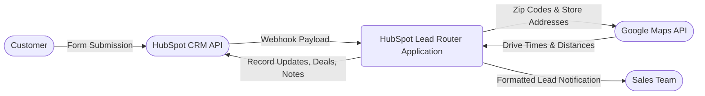
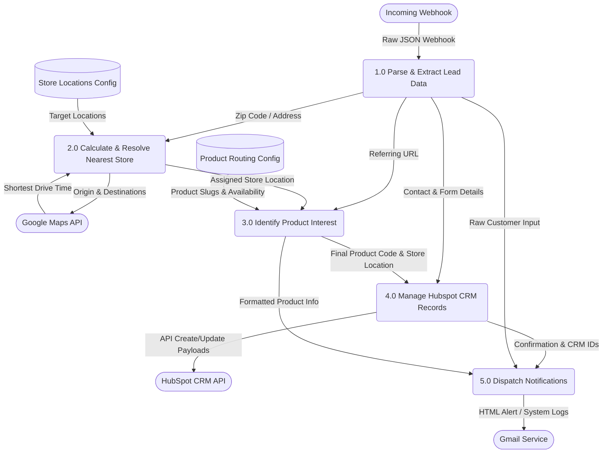

# HubSpot Location & Product Filter Documentation

This document outlines the architecture, data flow, and core logic of the HubSpot Location & Product Filter middleware. It acts as an intelligent gateway, intercepting webhook payloads to automate store routing, product discovery, and CRM record management.

---

## 1. Data Flow Diagrams

The following Data Flow Diagrams (DFDs) map how data enters the system, transforms through various internal processes, and exits to external APIs.

### 1.1 Context Diagram (Level 0)
This high-level overview illustrates the system boundaries and its interactions with external entities.

### 1.2 System Data Flow (Level 1)
This diagram breaks down the application into its core processing steps, showing the movement of data between specific logical functions and internal configuration maps.

---

## 2. Step-by-Step Processing Logic

### Step 1.0: Parse & Extract Lead Data
- **Input:** Raw JSON payload generated by a newly enrolled contact in a HubSpot workflow.
- **Action:** Parses the JSON to extract identity data (`hs_object_id`, Name, Email), geographic context (Zip code), original referring URLs, and user-uploaded file attachments.

### Step 2.0: Calculate & Resolve Nearest Store
- **Input:** The customer's extracted Zip code and the predefined internal list of store locations.
- **Action:** Queries the **Google Maps Distance Matrix API**.
- **Logic Rules:**
  - Evaluates drive times to find the absolute closest store in minutes.
  - **Drive-Time Thresholds:** If the closest store is Knoxville, the maximum permitted drive time is **180 minutes**. For all other stores, the maximum is **150 minutes**.
  - **Fallback:** If thresholds are exceeded, or no location data is present, the lead is defaulted to the **National** routing queue.

### Step 3.0: Identify Product Interest
- **Input:** The HubSpot URL referrer input.
- **Action:** Performs a string-matching sequence against a library of known product slugs (e.g., `metal-roofing`, `titan-loc-150`).
- **Logic Rules:** 
  - Sorts slugs by length to perform a "longest-match-first", preventing partial match errors (e.g., matching `corrugated` when it should be `1-25-corrugated`).
  - Verifies local stock limits: If the identified product is not sold at the store resolved in Step 2.0, the lead is diverted to **National**.

### Step 4.0: Manage HubSpot CRM Records
- **Input:** Extracted lead data, the resolved routing store, and the identified product slug.
- **Action:** Executes a sequence of HTTP requests to the HubSpot CRM API (v3/v4).
- **Execution Order:**
  1.  **Contact Patch:** Updates standard and custom properties on the Contact record with the new location and product data.
  2.  **Duplicate Check (Throttling):** Queries existing Deals connected to the contact. Skips Deal creation if a Deal was created in the last **24 hours**.
  3.  **Deal Creation:** Creates a new Deal mapped to the Pipeline and Stage designated for the specific store location.
  4.  **Inquiry Creation:** Generates a custom Inquiry object (Internal ID `2-59384707`).
  5.  **Associations:** Binds the internal records together (Deal ↔ Contact, Inquiry ↔ Contact, Inquiry ↔ Deal).
  6.  **Attachments:** If files exist, creates a HubSpot Note containing URL links to the files and associates it with the Contact and Deal.

### Step 5.0: Dispatch Notifications
- **Input:** Operation results from the CRM and the original form answers.
- **Action:** Merges the data into an HTML table format.
- **Output:** Triggers the native `GmailApp.sendEmail` method. An alert is sent to the sales floor, and a full debug execution log is emailed to the developer monitoring address.

---

## 3. Maintenance & Configuration Maps

The script relies on hardcoded configurations acting as internal data maps. These should be updated manually within `Code.gs` when business operations shift.

### 3.1 Pipeline Configurations (`PIPELINE_MAP`)
Determines where Deals are created based on the location.
*   **Structure:** `{ "store_name": { "pipeline": "ID", "dealstage": "ID" } }`
*   **Current Default:** Pipeline `878985997`, Stage `1320561848`.

### 3.2 Store Locations Map (`LOCATIONS`)
The physical shipping or store addresses used as potential destinations during the Google Maps routing calculation.

### 3.3 Product Availability Map (`storeData`)
Arrays defining which specific product slugs are sold at each individual location. Used to enforce local vs. national routing requirements.

### 3.4 Environmental Variables
*   **`HUBSPOT_ACCESS_TOKEN`**: Must be managed securely via the Google Apps Script UI (Project Settings > Script Properties).
*   **`GOOGLE_MAPS_API_KEY`**: Must be managed securely via the Google Apps Script UI (Project Settings > Script Properties).
*   **`NOTIFICATION_EMAIL`**: Target mailbox alias(es) mapped for new lead notifications.
